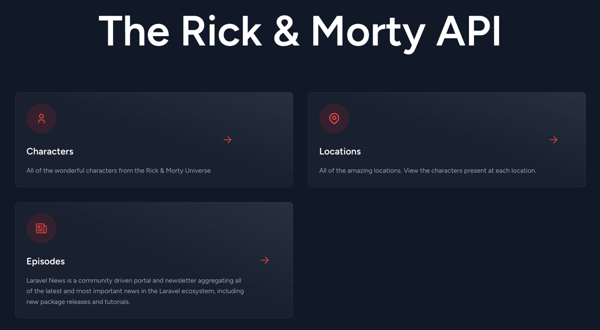
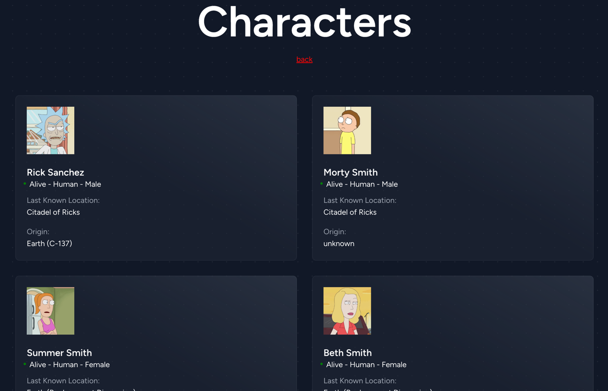
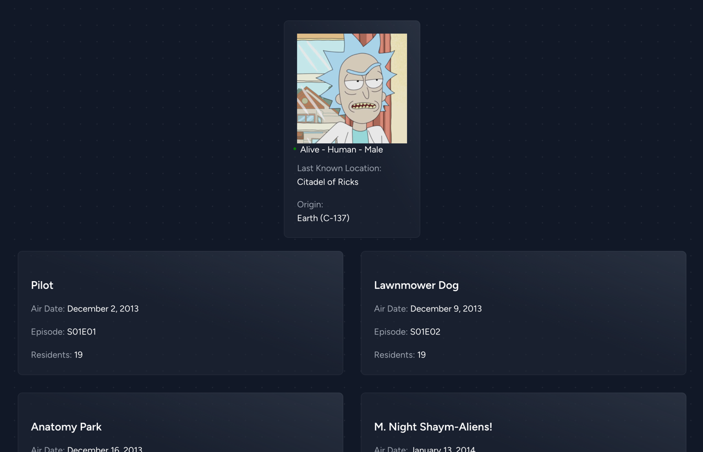
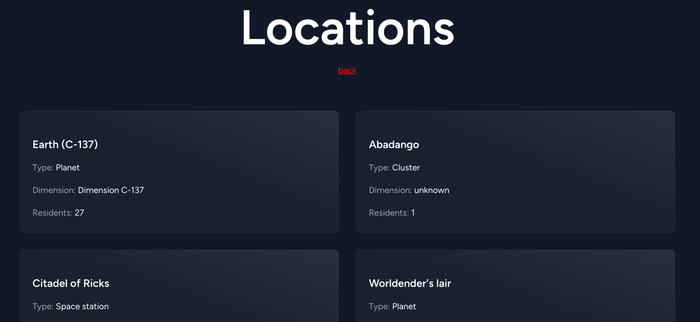
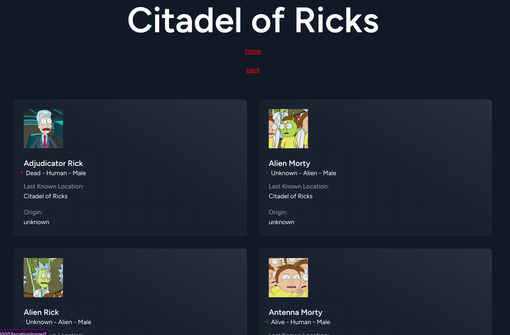
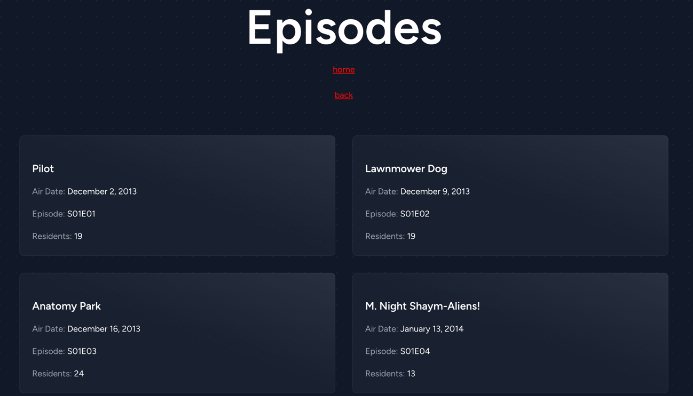

# The Rick & Morty Case

Using an API to retrive different kinds of information to showcase my skills as a developer. The following are the goals:

- Show all characters that exist (or are last seen) in a given dimension
- Show all characters that exist (or are last seen) at a given location
- Show all characters that partake in a given episode
- Showing all information of a character (Name, species, gender, last location, dimension, etc)

## Bonus

- Dockerize it
- Use awesome techniques
- Make it (the code) look pretty
- Integrate 1 or more extra API's in a creative way
- Explain in detail how a plumbus is made (yes, this is real)

## Tools

- PHP 8.1.19
- Laravel 10.21.0
- Blade

# Visuals of project

## The Home Page

## View All Characters
You can view all the characters of the show, 20 are shown per page. You can easily navigate between pages from the buttons at the bottom.

## Single Character
For each character you can view all the episodes they have been in. Clicking on an episode opens a list of the co-stars of the episode. 

## View All Locations
For each location see who else is present there. 

## View all Episdoes
See all the episodes of the show with details for each one. Clicking on an episode open all the characters that appear. 

### Links

- **[Rick and Morty API](https://rickandmortyapi.com/)**
